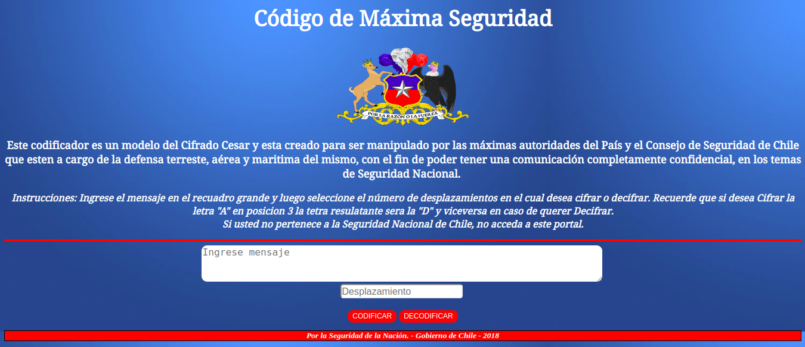

# 

# Cifrado César
CÓDIGO DE MAXIMA SEGURIDAD

Este codificador es un modelo del Cifrado Cesar y esta creado para ser manipulado por las máximas autoridades del País y el Consejo de Seguridad Nacional de Chile que esten a cargo de la defensa terreste, aérea y maritima del mismo, con el fin de poder tener una comunicación completamente confidencial, en los temas de Seguridad Nacional y proteción del país.

La necesidad de uso de este portal surge luego de un consenso entre los cuerpos de seguridad, el Consejo de Seguridad Nacional y la máxima autoridad del país los cuales requerian de una herramienta que les pemitiera sostener una comunicacion totalmente confidencial apegados a los códigos de eticas y privacidad entre si.

# Proceso y Decisiones de Diseño
Esta herramienta esta creada para que nuestro usuario pueda realizar su operación de una manera sencilla y confiable, para ello hemos creado un recuadro de texto donde este pueda ingresar su texto y posterior a esto seleccionar en el recuadro de abajo el numero de desplazamiento, obteniendo segun el boton que indique el cifrado o decifrado de su código. Se ha trabajado de manera centrada de manera tal que permita a los usuarios tener un enfoque directo en los recuadros a trabajar. Los colores utilizados estan basados en la paleta de colores de la bandera de chile y focalizando de una manera centrada el escudo de la patria.   

# Ususarios y su relación con el producto
Las máximas autoridades del País y el Consejo de Seguridad Nacional de Chile que esten a cargo de la defensa terreste, aérea y maritima. El Presidente envia mensajes a todods los cuerpos de seguridad y estos a su vez a el, permitiendole tener un control de todo lo que sucede en el territorio nacional.

# El producto y solución del problema
Los usuarios no tenian una herramienta segura que les permitiera comunicarse entre si, sin que estas comunicaciones fueran interceptadas agravando de alguna manera las acciones a tomar en temas de Seguridad.
Este producto al ser diseño basado en el Cifrado Cesar permite a nuestros usuarios tener una comunicación más segura y confidencial ya que dicho código sin algunos parametros establecidos no puede ser decifrado por algun otro medio

No Borrar
## Checklist
Esta sección está  para ayudarte a llevar un control de lo que vas completando.

### Parte Obligatoria
* [X] `README.md` incluye info sobre proceso y decisiones de diseño.
* [X] `README.md` explica claramente quiénes son los usuarios y su relación con
  el producto.
* [X] `README.md` explica claramente cómo el producto soluciona los
  problemas/necesidades de los usuarios.
* [X] Usa VanillaJS.
* [X] No utiliza `this`.
* [X] Implementa `cipher.encode`.
* [X] Implementa `cipher.decode`.
* [X] Pasa linter con configuración provista.
* [X] Pasa pruebas unitarias.
* [X] Pruebas unitarias cubren 70% de _statements_, _functions_ y _lines_, y un
  mínimo del 50% de _branches_.
* [x] Interfaz permite elegir el `offset` o _desplazamiento_ a usar en el
  cifrado/descifrado.
* [X] Interfaz permite escribir un texto para ser cifrado.
* [ ] Interfaz muestra el resultado del cifrado correctamente.
* [X] Interfaz permite escribir un texto para ser descifrado.
* [X] Interfaz muestra el resultado del descifrado correctamente.

### Parte Opcional: "Hacker edition"
* [X] Cifra/descifra minúsculas
* [ ] Cifra/descifra _otros_ caracteres (espacios, puntuación, `ñ`, `á`, ...)
* [ ] Permite usar un `offset` negativo.
